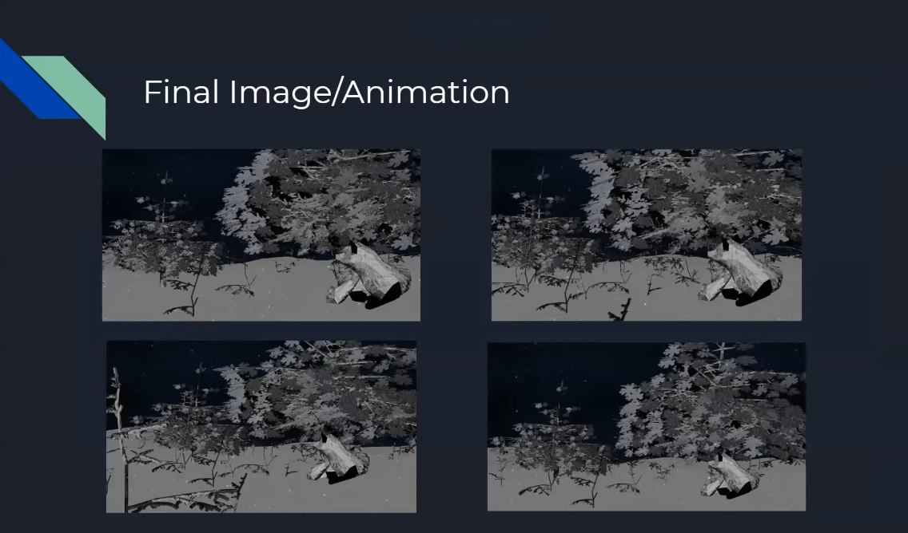

### Procedurally Generated CG Winter Landscape

## Overview 

A good reason to love the world is the beauty of nature, so in that vein I decided to create something that I thought was beautiful in nature, a snowy forest. To create this, I used a combination of L-systems, Perlin noise functions for the terrain as well as snow textures, a shadertoy for the parallax snowfall, and various graphics algos. 

I used two L-systems: one to generate the bigger leafier trees and another to generate the tiny twig trees. Within these L-systems, I created trees that were random from each other by introducing random selection of rules in my L-system, random selection of angles of rotation and random selection of the number of iterations of an L-system for a tree. I also implemented the ability to randomly generate trees in different non-duplicate locations within a plane. This is used to generate a bunch of the smaller twig trees within the area I was working. I applied a texture and normal mapping to the tree bark and leaves. For the tree bark part of the texture, I randomly generated white on the tree’s texture using the Perlin Noise function to create a new snowy texture. For the leaves, I loaded in an already snowy texture and turned-on alpha blending. To create the hilly snow terrain, I used Perlin noise on the vertices of a plane like we did in assignment 4. I then applied a texture and normal mapping to the snow terrain. For the snow particle effect, I slightly edited an algorithm from shaderToy that used a hash to determine whether to a draw a snowflake at a given pixel then had them move downward based on time. Multiple iterations of this effect were stacked on top of each other to create the snow effect as it appears in my image. To create the nighttime background, I simply mapped a night texture to the background object. I mapped textures and used a normal mapping for the fox. I also edited the texture of the fox by changing parts of it to white in its shader to fit the snow theme.  

## Final Image (The snowfall is animated, see gif in "Final Images and Report" folder)

# Procedurally Generated Forest 

## Terrain

## L-Systems

## Tree Albedos and Textures

## 

## Technical Implementation details

L-system Algorithm to Generate Trees: 
 	The algorithm starts by checking for a variable to see what axiom and rule set it is going to use (I only implemented two axioms/rule sets). An axiom is just a string and a rule set is a list of rules for an L-system. A particular rule could have multiple outcomes, e.g., a rule where A could turn to B or C. Once the axiom and rule set are decided the algorithm loops through the axiom letter by letter and checks if each letter has a rule. If it does, then the rule is applied and added to a new string. If the rule had multiple outcomes for the letter, then the one of the rules is randomly selected with equal probability. If the letter had no rule, then the letter is simply appended to the new string. This loop is applied a given number of times to the axiom. The meaning of each individual letter can be referenced in the comments above the axioms. If a letter’s meaning is not specified, then it can be assumed to have no meaning; they are placeholders. The axioms/rule sets I made up from a combination of those I found online and in-class.    
	After generating a string, I used it to create two mesh models for a tree: one for its leaves and one for its branches. This was done to allow me to easily apply different textures to the leaves and branches. The algorithm to create the two mesh parts goes as follows: First I created the triangles and vertices for a 1-unit tall low-resolution cylinder mesh, the mesh is like a cylinder but with a hexagon instead of a circle face on the top/bottom. I also created a 1-unit tall rectangle mesh. Their bottom parts (one of the hexagon faces for the cylinder and the one of the shorter edges of the rectangle) were centered at the origin. I then set a starting point which was the given starting destination for the tree generation. Then I set a target point that was one above this point in the z direction. I also set up a transformation matrix along with other variables to keep track of transformations done to the meshes. I then looped through a generated axiom letter by letter. If the letter was one of these: “XxYxZz”, then a random angle of rotation was applied to the target vector, if “Ssr” then a factor was multiplied to a scale factor variable. If “[” then the current variables were pushed on a stack and if “]” the values were popped off the stack and the current variables were updated to them. If “B” or “L” were encountered, then the arbitrary axis rotation matrix was calculated to get from the vector (0,0,1) to the (target point-starting point) vector. This replaced the rotation part of the transformation matrix. If “B”, the original cylinder has its vertices transformed by the matrix and the scale factor. If “L”, then it would be the rectangle. These new vertices of the cylinder are added to the branch mesh and those of the rectangle to the leaves mesh, along with their triangle relationships and the uvs for the leaves (which were manually put in by me based on the texture I was using for the leaves). Once added, the starting point is updated to the target point and the target point is updated to one ahead in the current forward direction (the direction of the (target point-starting point) vector). This loop is continued until the axiom is finished. This creates the two meshes that form a tree. Afterwards, the branch mesh has its uvs initialized using spherical coordinates and both meshes are given textures/initialized. For the tree leaves, I turned on alpha blending and made sure that the leaves were put in the scene after the branches of the tree/other objects. I then manually ordered the creation of my trees based on their distance from the camera position I decided to use. I did this to make sure the alpha blending did not create an artifact from the perspective of my image.
Algorithm to generate plane of trees:  
To generate a group of trees within a plane, I first created a list of random coordinates within an x and y square area on the z=0 plane centered on a given point. I then shuffle these coordinates within the list. This process is done to insure no duplicate random x/y coordinates. I then loop through a given number of cords within the list and generate a z coordinate for an x/y pair within the plane based on a given normal and the given point. A tree is then generated at this point. 
Perlin Noise Generated Tree Texture
I loaded in the texture for a tree normally. Then when the noise Octave function: .1*tan(noiseOctave (1.5*vtx_pos.xz, 3) was positive I changed the tree albedo to white. This creates a cool snow effect on the trees. 
Algorithm to Generate Snow Terrain: 
The algorithm was the same as the one in assignment 4. I mixed two different noise Octaves to create a hilly and a flat part of the terrain, i., e., whenever 2.*noiseOctave(.01*2.*v,10) was negative then 9.5*abs(sin(noiseOctave(.01*2.*v,10))) was applied. I also used a texture and normal mapping on the plane this time instead of a noise generated color.  
Algorithm to generate snow effect:  
The algorithm for the snow effect is borrowed from a shaderToy. I did not create it myself and only edited the version from shaderToy to fit within our project and changed a few constants. The algorithm works by taking in a pixel coordinate and using a hash to generate a random number to determine whether to draw a snowflake at that location. Then it uses iTime to simulate the falling effect. This effect is then greatened using a parallax effect. Basically, several iterations of this snow effect are generated on top of each other with smaller flakes drawn further back with decreasing speed.  

## Solved Challenges

The first challenge I ran into was trying to place a bunch of little twig trees within my scene. I figured this would take too long manually so I created a function that would do that for me which is the generate_Forest() function. It works off the algorithm I described in Algorithm to generate plane of trees in the technical implementation. This ended being even better than doing it manually because I got see and pick from many different random generations of twig forests for my scene. A second challenge I ran into was finding a good snow texture for a tree. All I could find online for tree texture were just for plain trees. I really wanted to put snow on my tree so I figured I could just take one of these plain tree textures and use Perlin noise to generate snow on top of it. It ended up creating a cool random snow effect for the tree textures. The last challenge that I will mention was trying to introduce randomness into my L-system. The solution to this came down to adding the ability to change the number of iterations of the L-system, to switch between L-systems, the random chance to switch rules for a letter, and adding a random range for the angle of rotation within a tree.  

## Contributions

- Jacob Werzinsky (main author)

- Professor Zhu 

- ShaderToy that I modified and used for the parallax snow effect
 
I will however link the shaderToy I used the algorithm from to generate the parallax snow effect that I only slightly edited to fit into my program: 
https://www.shadertoy.com/view/ldsGDn 
 
